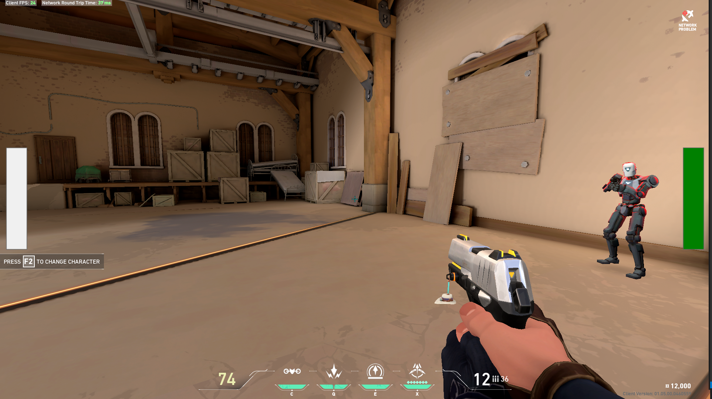

# Stereo Sound View

# Goal
This program is meant to visualize the directional left and right sounds heard in many video games. I first thought of this when one side of my headphones broke and I had a lot of trouble playing some of my favorite first-person video games. The scope of the problem goes beyond broken headphones; people with impaired hearing are put at a disadvantage, especially in games where directional sound cues are critical. My aim is to solve that with a visual indicator of stereo sounds.

Plus, I can't hear anyone to the left of me in Valorant.

